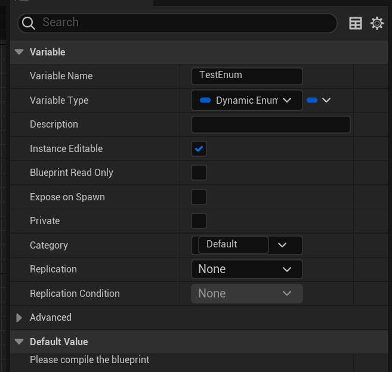
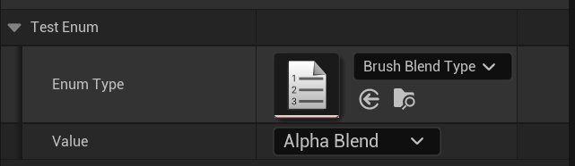
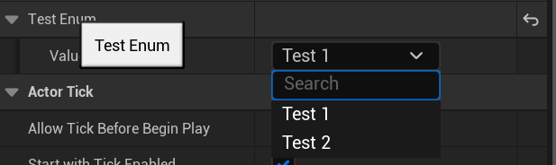
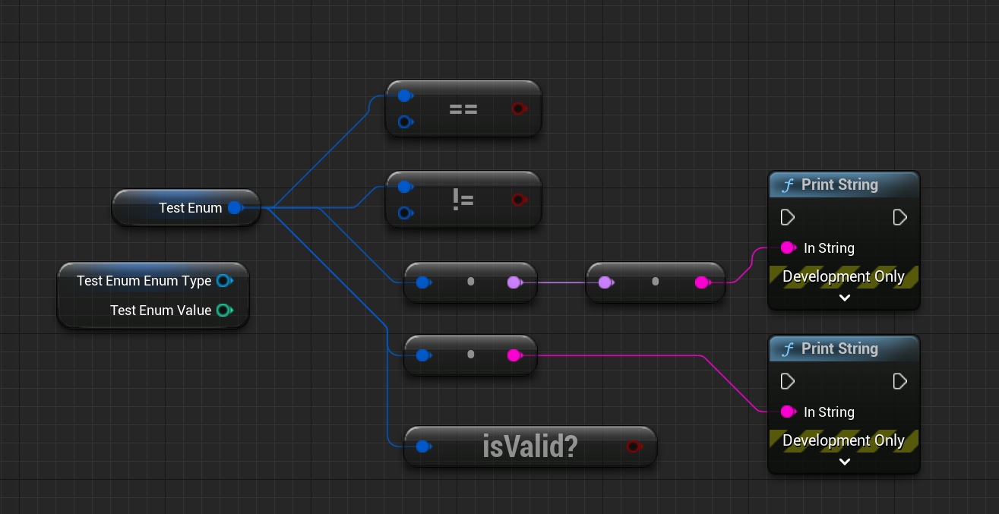

# Dynamic Enum Plugin for UE5

This is a plugin with a dynamic enum struct for UE5(**May not work in UE4**).

## Feature

- [x] Dynamic Set Enum Type in Blueprint
- [x] Select Enum Value from ComboBox
- [x] Pre Set Enum Type use MetaData
- [x] IsValid/Equal/ToFName/ToString K2Methods
- [ ] Pre Set Enum Type use ProjectSettings

## Install

1. Download from https://github.com/hanerx/DynamicEnum

2. Add to `Game/Plugins` folder

3. Recompile your project

## QuickStart
To use this Plugin is really simple, just use as normal UStruct like this:
```c++
UPROPERTY(EditAnyWhere)
FDynamicEnum TestEnum
```

Or define variable in blueprint like this:



Then you can use it in your blueprint:



### Use With MetaData

You also can pre define enum type by using metadata, make your code like this:

```c++
UPROPERTY(EditAnywhere,meta=(Enum="ETestEnum"))
FDynamicEnum TestEnum;
```

Then your variable will show like this (Enum Type will not editable and invisible in editor):



### K2 Methods in Blueprint

DynamicEnum support some K2 Methods that you can use in your blueprint:

